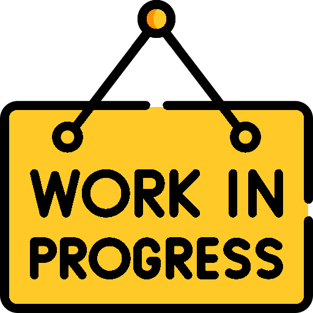

<p align="center">
  <a title="edaa-org.github.io/pyEDAA.OutputFilter" href="https://edaa-org.github.io/pyEDAA.OutputFilter"></a>
</p>

[](https://GitHub.com/edaa-org/pyEDAA.OUTPUTFILTER)
[](LICENSE.md)
[](https://edaa-org.github.io/pyEDAA.OUTPUTFILTER/)
[](LICENSE.md)  
[](https://pypi.org/project/pyEDAA.OUTPUTFILTER/)

  
[](https://GitHub.com/edaa-org/pyEDAA.OUTPUTFILTER/actions/workflows/Pipeline.yml)
[](https://libraries.io/github/edaa-org/pyEDAA.OUTPUTFILTER)
[](https://www.codacy.com/gh/edaa-org/pyEDAA.OUTPUTFILTER)
[](https://www.codacy.com/gh/edaa-org/pyEDAA.OUTPUTFILTER)
[](https://codecov.io/gh/edaa-org/pyEDAA.OUTPUTFILTER)

<!--
[](https://github.com/edaa-org/pyEDAA.OUTPUTFILTER/network/dependents)
[](https://requires.io/github/edaa-org/pyEDAA.OUTPUTFILTER/requirements/?branch=main)
[](https://libraries.io/github/edaa-org/pyEDAA.OUTPUTFILTER/sourcerank)  
-->

<p align="center">
  
</p>

# Main Goals

* Live and offline parsing and classification of message lines from tool outputs.
* Provide a data model for tool specific log files.
* Extract values, lists and tables of embedded reports or summaries.
* Implement checks and policies.

# Use Cases

* Write colorized logs to CI server logs or to shells based on classification.
* Increase or decrease the severity level of message.
* List messages of a certain kind (e.g. unused sequential elements).
* Check for existence / non-existence of messages or outputs (e.g. latches).
* Collect statistics and convert to datasets for a time series database (TSDB).

# Examples

```python
from pathlib import Path
from pyEDAA.OutputFilter.Xilinx.Synthesis import Processor

logfile = Path("tests/data/Stopwatch/toplevel.vds")
processor = Processor(logfile)
processor.Parse()

print(f"CRITICAL WARNING Messages ({len(processor.CriticalWarningMessages)}):")
for message in processor.CriticalWarningMessages:
  print(f"  {message}")
```

# Contributors

* [Patrick Lehmann](https://github.com/Paebbels) (Maintainer)
* [Unai Martinez-Corral](https://github.com/umarcor)
* [and more...](https://github.com/edaa-org/pyEDAA.OutputFilter/graphs/contributors)

# License

This Python package (source code) is licensed under [Apache License 2.0](LICENSE.md).
The accompanying documentation is licensed under [Creative Commons - Attribution 4.0 (CC-BY 4.0)](doc/Doc-License.rst).

-------------------------
SPDX-License-Identifier: Apache-2.0
